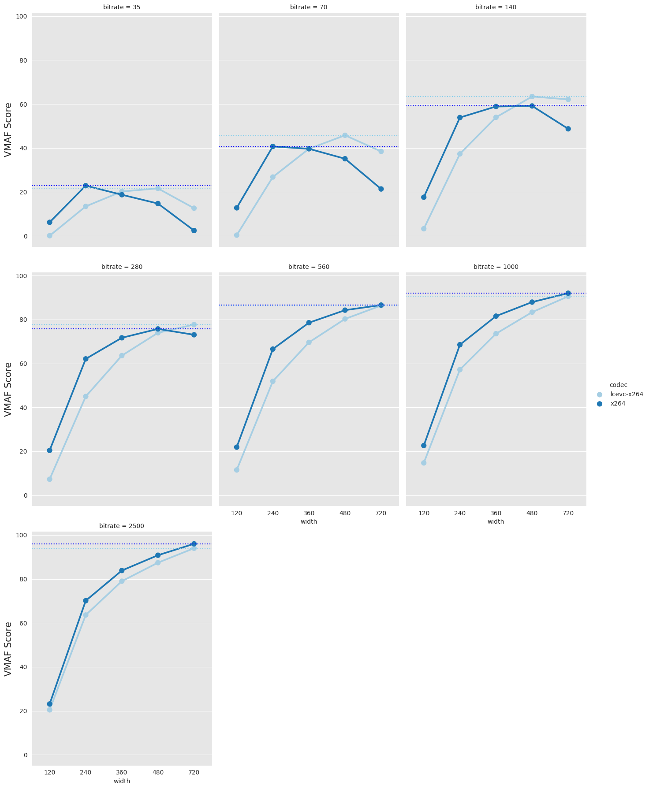
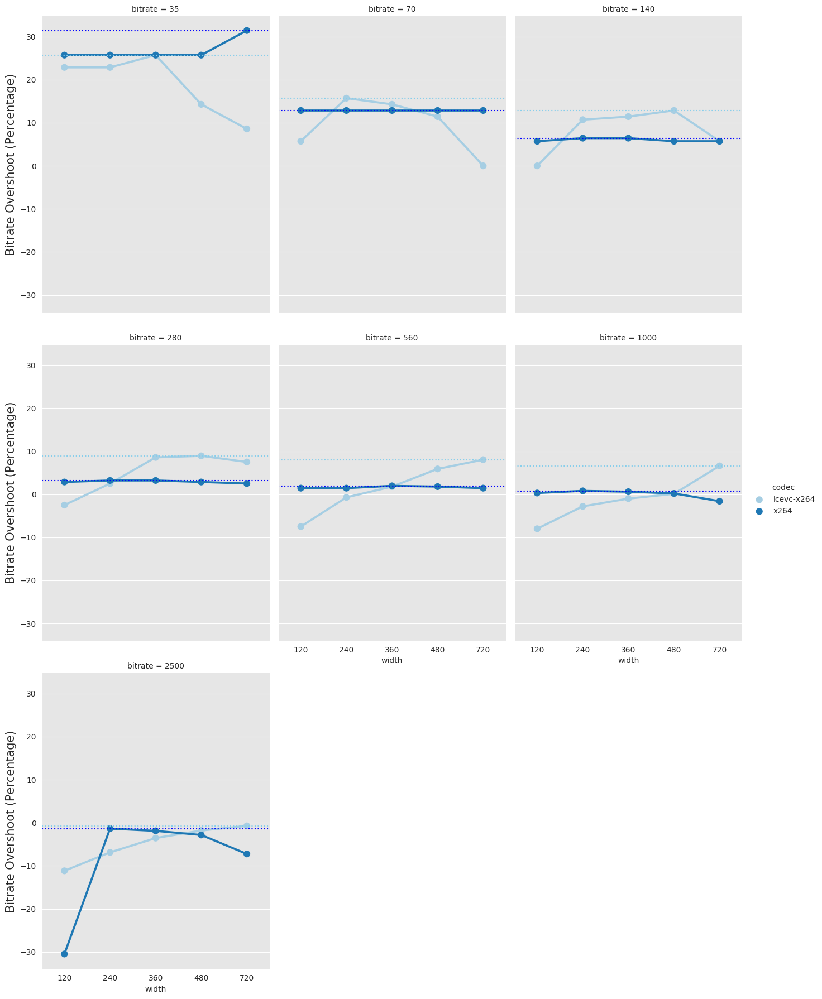

# Rate-Distortion Curve Test Code


# Abstract

This document presents a tool to test video codecs, calculating RD-curves for a series of parameters. It can be easily extended to test any other codecs.


# 1. Introduction
We want to characterize the rate-distortion curve for a set of video encoders. The goal is understanding the influence of the bitrate on distortion.


# 2. Operation

## 2.1. Data Gathering
The tool that runs the experiments is called `rdtest.py`. In order to run it, first you need to find a reference file that will be used to test the encoder.

Run a simple encoder test:

```
$ ./rdtest.py /tmp/input.mp4 /tmp/results.txt --tmp-dir /tmp/rdtest_tmp --codecs x264 vp8 --resolutions "216x120" --bitrates "35" --rcmodes "cbr" -d
```

Notes:

* test will run the 2 specified codecs (x264 and vp8), for a single resolution (216x120), a single bitrate (35 kbps), and a single rate control model (CBR),
* for any of the 4 setting fields (`codecs`, `resolutions`, `bitrates`, and `rcmodes`), you can set multiple values by using 3 different syntaxes:
  * (1) '`--<setting> val1 val2 val3`'
  * (2) '`--<setting> "val1 val2 val3"`'
  * (3) '`--<setting> val1,val2,val3`'
* defined codecs so far are `mjpeg`, `x264`, `openh264`, `x265`, `vp8`, `vp9`, and `libaom-av1`.
* "-d" forces debug mode (useful to test the script).
* the test requires a VMAF distribution, either a separate one (slower), or an ffmpeg binary that supports VMAF (faster).


Once you are happy with the results, run the full experiment.

```
$ ./rdtest.py input.mp4 --tmp-dir /tmp/rdtest_py_tmp -ddd /tmp/results.txt
```

The results are dumped to a text file, which contains a CSV collection of encoding parameters and video quality results (PSNR, SSIM, and VMAF).

```
$ cat /tmp/results.txt
# in_filename,codec,resolution,rcmode,bitrate,actual_bitrate,psnr,ssim,vmaf
input.mp4,x264,1280x720,cbr,2500,2482.388411876516,36.289466,0.969651,93.990081
input.mp4,x264,1280x720,cbr,1000,1071.2853116602216,34.985670,0.960191,90.600757
input.mp4,x264,1280x720,cbr,560,605.5676738546241,34.229312,0.951959,86.328370
input.mp4,x264,1280x720,cbr,280,305.3348626859802,33.100183,0.938104,77.790853
input.mp4,x264,1280x720,cbr,140,148.407812807236,31.355631,0.915891,62.140263
...
```

## 2.2. Data Plotting
The tool that plots the results of the previous experiments is called `rdplot.py`. In order to run it, you need to `results.txt` file generated by the previous tool.

```
./rdplot.py results.txt
```


Figure 1 shows the VMAF results of the x264 vs. openh264 encoders.


Figure 2 shows the bitrate accuracy (overshoot) results of the x264 vs. openh264 encoders.


# 3. References


# Appendix: Install VMAF Support

## A.1. Install Separate VMAF Support

First, check whether your `ffmpeg` binary already has VMAF support. Run the following script:

```
ffmpeg_vmaf=$(ffmpeg -filters|&grep libvmaf |grep "Calculate the VMAF")
if [[ "${ffmpeg_vmaf}" == *"Calculate the VMAF"* ]]; then
  echo "ffmpeg supports VMAF"
else
  echo "ffmpeg does not support VMAF"
fi
```


If the script produces "ffmpeg supports VMAF", you are done.

Otherwise, install the VMAF repo:

```
$ cd ~/proj/
$ git clone https://github.com/Netflix/vmaf
$ cd vmaf
-- make sure you have numpy 1.5
$ sudo pip install numpy==1.15
$ make
$ sudo make install
```


Notes:

* replace the `includedir` variable in `/usr/local/lib64/pkgconfig/libvmaf.pc` with `includedir=${prefix}/include/libvmaf`, and then build `ffmpeg` from source.
* if you decide to install it in a different place, use the `--vmaf-dir` CLI option to let `rdtest.py` know about the location


Now build ffmpeg from the source with support for the library.

```
$ cd ~/proj/
$ git clone git://source.ffmpeg.org/ffmpeg.git ffmpeg
$ cd ffmpeg
$ PKG_CONFIG_PATH=/usr/local/lib64/pkgconfig ./configure --enable-libvmaf --enable-version3
...
$ make
$ sudo make install
```

